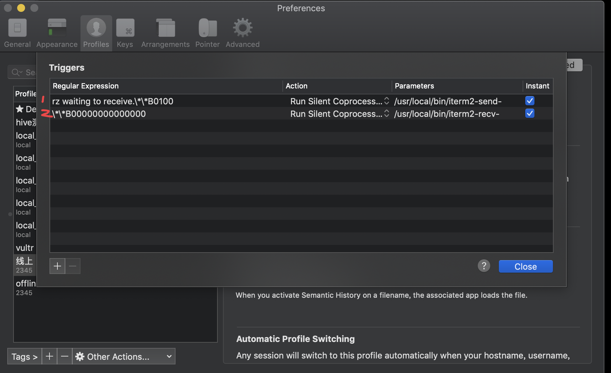

## item 扩展

### imgcat

​	`imgcat` - 像 cat 纯文本一样，cat 图片，疗效很好

### imgls

`imgls` - 像 ls 一样显示显示目录下的 图片

### iterm2-recv-zmodem

### iterm2-send-zmodem

#### 步骤

1.安装支持rz和sz命令的lrzsz：`brew install lrzsz`

> 等了挺长时间的。

2.在本地/usr/local/bin/目录下保存iterm2-send-zmodem.sh 和iterm2-recv-zmodem.sh两个脚本

3.设置一下两个脚本的权限，一般 chmod 777 就行了

```bash
chmod 777 /usr/local/bin/iterm2-*
```

4.设置Iterm2的Tirgger特性，profiles->default->editProfiles->Advanced中的Tirgger

添加两条trigger，分别设置 Regular expression，Action，Parameters，Instant如下：

```
1.第一条
        Regular expression: rz waiting to receive.\*\*B0100
        Action: Run Silent Coprocess
        Parameters: /usr/local/bin/iterm2-send-zmodem.sh
        Instant: checked
2.第二条
        Regular expression: \*\*B00000000000000
        Action: Run Silent Coprocess
        Parameters: /usr/local/bin/iterm2-recv-zmodem.sh
        Instant: checked
```


## m3umk

```
Example Usage:
    m3umk ~/Music > out.m3u
    Example with random order:
    m3umk ~/Music | shuf > out.m3u
```


## prettyping

`rettyping` is a wrapper around the standard `ping` tool with the objective of making the output prettier, more colorful, more compact, and easier to read.

`prettyping` runs the standard `ping` in the background and parses its output, showing the ping responses in a *graphical* way at the terminal (by using colors and Unicode characters).

`prettyping` is written in `bash` and `awk`, and is reported to work on many different systems (Linux, Mac OS X, BSD…), as well as running on different versions of `awk` (`gawk`, `mawk`, `nawk`, `busybox awk`).

## t

`tmuximum` simplifies complex tmux operation such as `tmux attach -t SESSION`, `tmux kill-session -t SESSION` and `tmux select-window -t WINDOW`, etc. You can do all these operations with `tmuximum`alone


## free-memory

Mac `free` comand


## fzf-tmux

[fzf-tmux](https://github.com/junegunn/fzf/blob/master/bin/fzf-tmux) is a bash script that opens fzf in a tmux pane.

## archey

```
✗  archey

                 ###                  User: jxw3ng
               ####                   Hostname: m1.xitr.me
               ###                    Distro: OS X 11.4
       #######    #######             Kernel: Darwin
     ######################           Uptime: 2 days
    #####################             Shell: /opt/homebrew/bin/zsh
    ####################              Terminal: screen-256color iTerm.app
    ####################              Packages: 125
    #####################             CPU: Apple M1
     ######################           Memory: 16 GB
      ####################            Disk: 4%
        ################              Battery: 91%
         ####     #####               IP Address: 126.71.102.32
```

